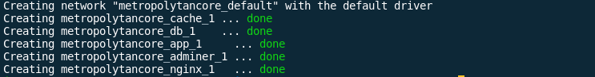

## Backend Installation

### Containerized Setup

#### Requirements

-   [x] [Docker](https://docs.docker.com/get-docker/)
-   [x] [Docker Compose](https://docs.docker.com/compose/)

:warning: please consider changing `.env.docker.example` to `.env` and find your local User ID and Group ID and replace `USER_ID` and `GROUP_ID` with their values :warning:

For Linux and macOS

```bash
~$ id -u
1000
~$ id -g
1000
```

For Windows(consider using WSL or [check this](https://stackoverflow.com/questions/56290892/get-userid-in-ms-windows-for-uid-and-gid-mapping))

1. make sure you are in the project directory and run

```bash
 docker-compose up -d
```

`-d` means run containers without verbose

:warning: **wait arround 5-10 min to build images and run container** :warning:

2. you should get a result that look like this
   

:warning: TIPS :warning:
- To stop the app run in terminal `docker-compose down`
- In order to access shell terminal in a specific container `docker-compose exec <container-name> sh` replace `<container-name>` with the containers names below
    - `app` : laravel app contains (yarn, composer)
    - `cache`: cache server
    - `nginx`: web server
    - `db`: PostgreSQL database
    - `adminer` : alternative to phpmyadmin (used to administrate DB)
- In order to run yarn run watch `docker-compose exec app yarn  watch`
### Regular Setup

#### Requirements

-   [x] [PHP 8.x and above](https://www.php.net/manual/en/install.php)
-   [x] [Composer](https://getcomposer.org/doc/00-intro.md)

1. Install PHP Dependencies

```bash
composer install
```

2- Setup env variables and adjust it depending on your environment setup

```bash
cp .env.example .env
```

3- generate application key

```bash
php artisan key:generate
```

4- install node dependencies

```bash
yarn install
```

5- build frontend

```bash
yarn run dev
```

6- run migration

```bash
php artisan migrate
```

7- serve the application

```bash
php artisan serve
```

:warning: **application will be served at port 5500** :warning:
